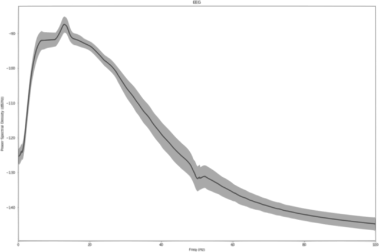

МИНИСТЕРСТВО ОБРАЗОВАНИЯ И НАУКИ РОССИЙСКОЙ ФЕДЕРАЦИИ  Федеральное государственное автономное образовательное учреждение   высшего образования   «Национальный исследовательский   Нижегородский государственный университет им. Н.И. Лобачевского» Радиофизический факультет   Кафедра Теории  колебаний и автоматического регулирования

Направление «Биоинформатика»
 

ОТЧЕТ ПО НАУЧНО-ПЕДАГОГИЧЕСКОЙ ПРАКТИКЕ
 

Оптимизация методов предикации воображаемых движений   в интерфейсе мозг-компьютер

     
К защите допущен:

Декан радиофизического факультета,                                          .....................____________Матросов В.В.
Зав. кафедрой Теории колебаний
и автоматического регулирования,
профессор

Старший преподаватель ..........................................____________Мищенко М.А.
кафедры Теории колебваний
и автоматического регулирования,
к.ф.м.н

Студент 5 ............................................................................__________Михеев Е.В.
курса

 

Нижний Новгород   2017

   
### Оглавление

1. Введение..................................................................................................................3
2. Физиология электрической активности..................................................................3
2.1 Формирование потенциала...............................................................................3
2.2 Мозговые ритмы.................................................................................................4
2.3 Система зеркальных нейронов.........................................................................6
2.4 Применение в МКИ............................................................................................6
3. Стратегии осуществления МКИ..............................................................................7
  3.1. Организация измерений....................................................................................7
  3.2. Способы регистрации данных........................................................................8
    3.2.1. Асинхронный: непрерывный ЭЭГ..................................................................8
    3.2.2 Синхронный: "Моторное воображение"........................................................9
    3.2.3 Синхронный: связанный с событиями потенциал.......................................9
  3.3 Предобработка данных....................................................................................10
    3.3.1 Удаление артефактов....................................................................................10
  3.4 Выделение информации из сигнала...............................................................13
    3.4.1 ICA Метод независимых компонент..............................................................14
    3.4.2 PCA Метод главных компонент.....................................................................14
    3.4.3 CSP метод общих пространственных структур...........................................15
    3.4.4 Сравнение матриц ковариации в Римановском пространст......................17
  3.5 Алгоритмы клаcсификации..............................................................................19
    3.5.1 LDA Линейный дискриминантный анализатор Фишера.............................19
    3.5.2 Наивный Баесовский классификатор..........................................................20
    3.5.3 Метод k­ближайших соседей.........................................................................22
    3.5.4 Метод решающих деревьев..........................................................................23
    3.5.5 Метод опорных векторов SVM......................................................................25
    3.5.6 Многослойный прецептрон...........................................................................26
  4 Оптимизация моделей асинхронных МКИ.........................................................27

         

### 1 Введение
Электроэнцефалография (ЭЭГ) является методом электрофизиологического мониторинга для регистрации электрической активности головного мозга. Этот не инвазивный метод, заключается в размещении электродов вдоль скальпа (черепа). ЭЭГ измеряет колебания напряжения, возникающие в результате движения ионного тока в нейронах головного мозга. В клинических контекстах ЭЭГ относится к регистрации спонтанной электрической активности мозга в течение определенного периода времени [1], с помощью нескольких электродов, расположенных на голове. Диагностические приложения обычно фокусируются на спектральном содержании ЭЭГ, т. е. типе нейронных колебаний (обычно называемых «мозговые волны»), которые могут наблюдаться в сигналах ЭЭГ.

Интерфейсы мозг-компьютер (ИМК) — это система позволяющая осуществлять обмен информацией между мозгом и вычислительным устройством. ИМК -  активно развивающаяся технология, которая, как полагают, с развитием позволит решать множество прикладных задач:

- Медицина - управление устройствами позволит помочь парализованным людям, людям с двигательными ограничениями, людям с отсутствующими конечностями.
- Бытовое -  так же позволит повысить уровень комфорта позволив людям интерактивно и без дополнительных физических действий управлять бытовыми приборами.
- Рекреационные цели - построение систем управления в компьютерных играх,  дополненной и виртуальной реальности.

### 2 Физиология электической активности
#### 2.1 Формирование потенциала
Электрический заряд мозга поддерживается миллиардами нейронов [2]. Нейроны электрически заряжены (или «поляризованы») мембранными транспортными белками, которые перекачивают ионы через их мембраны. Нейроны постоянно обменивают ионы с внеклеточной средой, например, для поддержания потенциала покоя и распространения потенциалов действия. Ионы подобного заряда отталкиваются друг от друга, и когда много ионов одновременно выталкиваются из многих нейронов, они могут толкать своих соседей, которые толкают своих соседей и т. д., образуя волну. Этот процесс известен как объемная проводимость. Когда волна ионов достигает электродов на коже головы, они могут толкать или тянуть электроны на металле в электродах. Так как металл легко проводит отталкивание и притяжение электронов, разность напряжений между двумя любыми электродами может быть измерена вольтметром. Запись этих напряжений во времени дает нам ЭЭГ. [3]
Электрический потенциал, генерируемый отдельным нейроном, слишком мал, чтобы подхватывать ЭЭГ, [4] поэтому, активность ЭЭГ всегда отражает суммирование синхронной активности тысяч или миллионов нейронов, имеющих сходную пространственную ориентацию. Если клетки не имеют подобной пространственной ориентации, их ионы не выстраиваются в линию и создают волны, которые необходимо обнаружить. Пирамидальные нейроны коры, как полагают, производят тот самый сигнал ЭЭГ, потому что они хорошо выравниваются и активируются вместе. Поскольку поля напряжений падают с квадратом расстояния, активность от глубоких источников обнаружить труднее, чем токи вблизи черепа. [5]

#### 2.2 Мозговые ритмы
Скалярная активность ЭЭГ показывает колебания на разных частотах. Некоторые из этих колебаний имеют характерные частотные диапазоны, пространственные распределения и связаны с различными состояниями функционирования мозга (например, бодрствование и различные стадии сна). Эти колебания представляют собой синхронизированную активность по сети нейронов.

Большая часть мозгового сигнала, наблюдаемого в скальпе ЭЭГ, находится в диапазоне 1-20 Гц (активность ниже или выше этого диапазона, вероятно, будет артефактуальной при стандартных клинических методах записи). Формы сигналов подразделяются на полосы пропускания, известные как альфа, бета, тета и дельта, чтобы обозначить большинство ЭЭГ, используемых в клинической практике [6].

Таблица 1 - Классификация мозговых ритмов

Полоса  | Гц   | Локализация  | Активность
---     | ---  | --- | --- |
Дельта  |  < 4 |  Спереди у взрослых, сзади у детей; Высокоамплитудные  волны |  Медленный сон
Тета    | 4-7  | Находится в местах, не связанных с задачами | Быстрый сон, сонливость, торможение |
Альфа   | 8-15 | Задние области головы, с обеих сторон, выше по амплитуде на доминирующей стороне. Центральные зоны (c3-c4) в состоянии покоя | Расслабленность
Бета    | 16-31| С обеих сторон, симметричное распределение, наиболее очевидное спереди; Волны с малой амплитудой | Активное мышление, сосредоточенность, высокая готовность, тревожность |
Гамма   | >32  | Соматосенсорная кора | Сенсорная обработка, звук, зрение |
Мю      | 8-12 | Сенсомоторная кора| Состояние покоя двигательных нейронов|

- Альфа - это частотный диапазон от 7 Гц до 14 Гц. Ритм, видимый в задних областях головы с обеих сторон, с повышенной амплитудой на доминирующей стороне. Он возникает с закрытием глаз и с расслаблением, и ослабляется с открытием глаза или умственным напряжением.

- Мю - сенсомоторный ритм. В дополнение к заднему основному ритму существуют другие нормальные альфа-ритмы, такие как мю ритм (альфа-активность в контрлатеральных сенсорных и моторных областях коры), возникающая, когда конечности бездействуют; И «третий ритм» (альфа-активность в височной или лобной долях). [7][8]

#### 2.3 Система зеркальных нейронов
Система зеркальных нейронов была открыта в 1990-е у макак [9]. В ходе исследований были обнаружены нейроны, которые возбуждались, когда макаки выполняли простые задания, а также когда макаки наблюдали как кто-то другой выполнял такие же несложные задания [10]. Это говорит о том, что эти нейроны играют важную роль в обработке мозгом чужих движений без их физического повторения. Эти нейроны называют зеркальными нейронами, и они образуют систему зеркальных нейронов. Мю-ритм подавляется, когда происходит возбуждение этих нейронов. Благодаря этому феномену учёные могут изучать активность зеркальных нейронов у человека [11]. Имеются факты в пользу того, что зеркальные нейроны существуют как в организме человека, так и не человекообразных животных. Зеркальные нейроны у человека, предположительно, располагаются в правой латеральной затылочно-височной извилине, левой нижней теменной доле, правой передней теменной доле и левой нижней лобной извилине [9][12][13]. Некоторые исследователи полагают, что подавление мю-ритма может быть следствием активности зеркальных нейронов и представляет собой высокоуровневую интегративную обработку активности системы зеркальных нейронов [14][15][16][17]. Исследования на обезьянах (с использованием инвазивных методов регистрации) и на человека (с использованием ЭЭГ и фМРТ) показали, что зеркальные нейроны возбуждаются не только во время двигательной активности, но также отвечают на намерение [18].

#### 2.4 Применение в МКИ
Одним из типов МКИ является интерфейс, использующий событийно-связанную десинхронизацию мю-ритма для управления компьютером [19]. Этот метод мониторинга активности мозга основан на том факте, что когда группа нейронов находится в состоянии покоя они, как правило, возбуждаются синхронно. Если оператор МКИ мысленно представит движение («событие»), произойдет десинхронизация (связанная с «событием»). Нейроны, которые до этого возбуждались синхронно, приобретут свои индивидуальные, не похожие друг на друга паттерны возбуждения. Это приведёт к уменьшению амплитуды регистрируемого сигнала, которое может быть зафиксировано и проанализировано при помощи компьютера. Операторы подобных МКИ тренируются визуализировать движения ногами, руками и/или языком. Эти части тела имеют удалённые друг от друга проекционные зоны коры головного мозга и поэтому их легче всего отличить друг от друга на основе записей электроэнцефалограммы (ЭЭГ) или электрокортикограммы (ЭКоГ) с электродов размещённых над моторной корой [18][20]. Событийно-связанная десинхронизация может быть использована вместе с другими методами мониторинга электрической активности мозга, позволяя создавать гибридные ИМК, которые часто оказываются более эффективными, чем ИМК использующие только один метод мониторинга [18][20].

### 3 Стратегии осуществления МКИ

#### 3.1 Организация измерений
ЭЭГ запись получается путем помещения электродов на кожу головы с помощью проводящего геля или пасты, обычно после подготовки участка скальпа с помощью легкого истирания для уменьшения полного сопротивления из-за мертвых клеток кожи. Во многих системах обычно используют электроды, каждый из которых прикреплен к отдельному проводу. В некоторых системах используются колпачки или сетки, в которые встроены электроды; Особенно часто встречается, когда требуются массивы с высокой плотностью электродов.
Месторасположение и названия электродов определяются Международной системой 10-20 [23] для большинства клинических и исследовательских применений (за исключением случаев использования массивов высокой плотности). Эта система гарантирует соответствие названий электродов во всех лабораториях. В большинстве клинических применений используются 19 регистрирующих электродов (плюс земля и референтный электрод). [24] Дополнительные электроды могут быть добавлены к стандартной установке, когда клинические или исследовательские приложения требуют повышенного пространственного разрешения для определенной области мозга. Массивы высокой плотности (обычно через колпачок или сетку) могут содержать до 256 электродов, более или менее равномерно распределенных вокруг головы.
Каждый электрод подключен к одному входу дифференциального усилителя (один усилитель на пару электродов); Общий электрод сравнения системы соединен с другим входом каждого дифференциального усилителя. Эти усилители усиливают напряжение между активным электродом и эталонным (обычно 1000-100000 раз, или 60-100 дБ усиления по напряжению).  Усиленный сигнал оцифровывается через аналого-цифровой преобразователь после прохождения через сглаживающий фильтр. Аналого-цифровая выборка обычно происходит при частоте 256-512 Гц в клинической скальпе ЭЭГ; Частоты дискретизации до 20 кГц используются в некоторых исследовательских приложениях.
Во время записи может использоваться ряд процедур активации. Эти процедуры могут вызывать нормальную или ненормальную активность ЭЭГ, которую в противном случае можно было бы увидеть. Эти процедуры включают гипервентиляцию, фотостимуляцию (со вспышкой света), закрытие глаз, умственную деятельность, сон и лишение сна. Во время (стационарного) эпилептического мониторинга типичные приступы выписки пациента могут быть отменены.
Цифровой сигнал ЭЭГ сохраняется в электронном виде и может быть отфильтрован для отображения. Типичные настройки для фильтра верхних частот и фильтра нижних частот составляют 0,5-1 Гц и 35-70 Гц соответственно. Фильтр верхних частот обычно отфильтровывает медленный артефакт, такой как электрогальванические сигналы и артефакт движения, тогда как фильтр нижних частот отфильтровывает высокочастотные артефакты, такие как электромиографические сигналы. Дополнительный режекторный фильтр обычно используется для удаления артефакта, вызванного линиями электропередачи (60 Гц в США и 50 Гц во многих других странах). [25]
В рамках оценки эпилептической хирургии может потребоваться введение электродов вблизи поверхности мозга под поверхностью твердой мозговой оболочки. Это достигается с помощью заусенца или краниотомии. Эта процедура имеет различные названия такие, как «электрокортикография (ECoG)», «внутричерепная ЭЭГ (I-ЭЭГ)» или «субдуральная ЭЭГ (SD-ЭЭГ)». Глубинные электроды также могут быть помещены в структуры головного мозга, такие как амигдала или гиппокамп, структуры, которые являются общими эпилептическими очагами и не могут быть «четко видны» с помощью скальпа ЭЭГ. Электрокортикографический сигнал обрабатывается так же, как и цифровая скальп-ЭЭГ (см. Выше), с несколькими оговорками. ECoG обычно регистрируется с более высокой частотой дискретизации, чем скальп ЭЭГ из-за требований теоремы Найквиста - субдуральный сигнал состоит из более высокого преобладания высокочастотных компонентов. Кроме того, многие из артефактов, воздействующих на скальп ЭЭГ, не влияют на ECoG, поэтому фильтрация отображения часто не требуется.
Типичный сигнал ЭЭГ взрослого человека составляет приблизительно от 10 мкВ до 100 мкВ при измерении от скальпа [26] и составляет около 10-20 мВ при измерении от субдуральных электродов.
Так как сигнал напряжения ЭЭГ представляет собой разницу между напряжениями на двух электродах, отображение ЭЭГ для считывающего энцефалографа может быть установлено одним из нескольких способов. Представление каналов ЭЭГ называется монтажом.

#### 3.2 Способы регистрации данных
#### 3.2.1 Асинхронный: непрерывный ЭЭГ
Непрерывный или спонтанный ЭЭГ (то есть сигнал, который может быть просмотрен непосредственно во время записи) может быть полезен в клинических условиях, например. Для диагностики эпилепсии или опухолей, прогнозирования припадков эпилепсии, выявления ненормальных состояний мозга или классификации стадий сна. Исследование более конкретных перцепционных или когнитивных процессов требует более сложной обработки данных, например, усреднения сигнала по многим испытаниям.

#### 3.2.2 Асинхронный: "Моторное воображение"

"Моторное воображение" включает в себя движение различными частями тела, приводящее к активации сенсомоторной коры, которая модулирует сенсомоторные колебания в ЭЭГ. Они могут быть выявлены МКИ для определения намерения пользователя. Для получения информации о типе двигателной активности обычно требуется пройти несколько сеансов обучения до того, как будет получен приемлемый уровень качества МКИ. Тренировки могут занимать несколько часов в течение нескольких дней, прежде чем пользователи смогут последовательно использовать технику с приемлемыми уровнями точности. В процессе проведения тренирови для определения успешного ее выполнения, следует проводить анализ качества путем определения наличия десинхронизации по каждому сиганалу с каждого из электродов.

#### 3.2.3 Синхронный: связанный с событиями потенциал
Связанный с событиями потенциал (ERP) - это измеренная реакция мозга, которая является прямым результатом специфического сенсорного, когнитивного или моторного события. [21] Более формально это любой стереотипный электрофизиологический ответ на стимул. Является синхронный методом, так как непосредственно связан моментом предъявления раздражителя.
Результирующие «связанные с событиями потенциалы» характеризуются рядом особенностей волн или «компонентов» в их временном ходе, которые дифференциально выражены на разных участках записи на голове. Они классифицируются в соответствии с их полярностью (положительная / отрицательная) на конкретных точках записи активности и типичной задержкой их возникновения (например, N100 относится к отрицательному потенциалу около 100 мс, аналогично для P300, N400 и т. Д.).

Амплитуда и структура этих компонентов могут быть интерпретированы как зависимые переменные, которые отличаются своей зависимостью от выполняемой задачи, параметрами раздражения, степенью внимания и т. д. ЭЭГ отражает тысячи одновременно происходящих мозговых процессов. Это означает, что реакция головного мозга на единичный раздражитель или событие, представляющее интерес, обычно не видна в записи ЭЭГ одного исследования. Чтобы увидеть реакцию мозга на стимул, экспериментатор должен провести много испытаний и усреднить результаты вместе, вызывая случайную мозговую активность, чтобы ослабить и сохранить соответствующую форму волны, называемую ERP

#### 3.3 Предобработка данных
#### 3.3.1 Удаление артефактов

Артефакты присутствующие в исходном сигнале представляют собой различные постоянные или периодические паразитические сигнальные последовательности, такие как.

  - Электромагнитные помехи - люминесцентные лампы, фон от приборов, фон электрических сетей. Такие помехи обычно присутствуют в частотной области за пределами несущих информацию биосигналов, поэтому обычно применяются отсекающие фильтры по верхней и нижней границе.
  - Артефакты биосигналов - моргания глаз (EOG), миографические сигналы (EMG), кардиосиганлы (EKG), в таких случаях сигналы часто лежат в области информативных диапазонов биосигналов, поэтому задача отсечения такой информации менее тривиальна.

  Существует несколько подходов для удаления артефактов биосигналов.

  - Первый из них заключается в контроле обучения и применяется при исключении (EOG, EMG), когда респондент гарантирует отсутствие морганий и мышечной подвижности в процессе записи тренировочной активности.
  - Второй заключается в усреднении для синхронной методики: С инженерной точки зрения можно определить отношение сигнала к шуму (SNR) записанных ERP. Причина того, что усреднение увеличивает SNR записанных ERP (делая их различимыми и допускающими их интерпретацию), имеет простое математическое объяснение при условии, что сделаны некоторые упрощающие предположения. Эти предположения:
    1) Сигнал, представляющий интерес, состоит из последовательности событийных блокировок ERP с неизменной задержкой и формой
    2) Шум может быть аппроксимирован методом гауссовского распределения с средним отклонением $\sigma^2$, которое некоррелировано между испытаниями и не привязано ко времени события (это предположение может быть легко нарушено, например, в случае, когда субъект делает небольшие движения языка, или мысленно что то подсчитывает).
    Определив $k$, номер пробной версии и $t$, время, прошедшее после события $k$, каждое записанное испытание может быть записано как $x(t,k) = S (t) + n(t, k)$ где $s(t)$ сигнал, а $n(t, k)$ - шум (обратите внимание, что в вышеприведенных предположениях сигнал не зависит от конкретного испытания, в то время как шум зависит).
    Среднее количество испытаний $N$
    $${\bar  x}(t)={\frac  {1}{N}}\sum _{{k=1}}^{N}x(t,k)=s(t)+{\frac  {1}{N}}\sum _{{k=1}}^{N}n(t,k)$$
    Ожидаемое значение ${\bar{x}(t)}$ является (как ожидается) самим сигналом, ${E}[\bar{x}(T)] = s(t)$
    Его дисперсия равна
    $$ \begin{aligned} & {Var}[{\bar  x}(t)]  =   {E}\left[\left({\bar  x}(t)-{E}[{\bar  x}(t)]\right)^{2}\right]  =  \\ & {\frac  {1}{N^{2}}} {E}\left[\left(\sum _{{k=1}}^{N}n(t,k)\right)^{2}\right] =    {\frac  {1}{N^{2}}}\sum _{{k=1}}^{N}{E}\left[n(t,k)^{2}\right]= {\frac  {\sigma ^{2}}{N}} \end{aligned}$$
    По этой причине амплитуда шума в среднем для проб $N$ равна  $1/\sqrt{N}$ раз больше, чем в одном испытании.
    Широко-амплитудные шумы (например, мигание глаз или артефакты движения) часто на несколько порядков больше, чем лежащие в основе ERP. Следовательно, испытания, содержащие такие артефакты, должны быть удалены до усреднения. Отбраковка артефактов может быть выполнена вручную путем визуального осмотра или с использованием автоматизированной процедуры, основанной на предопределенных фиксированных порогах (ограничение максимальной амплитуды ЭЭГ) или на изменяющихся во времени пороговых значениях, полученных из статистики набора испытаний [22].
  - Третий метод заключается записи отдельных событий связанных с наличием артефактов к примеру EOG, EMG c последующим анализом их параметров и удалением из обучающей выборки, часто выделяются отдельные элетроды для записи сигналов несущих артефакты EOG,EMG,EKG. Практически вся саккадическая активность, регистрируемая набором ЭЭГ сенсоров, расположенных в соответствии со стандартной схемой 10-20, может быть описана вариацией сигнала в подпространстве  Ψ  небольшой размерности (D = 2-4). Этот факт позволяет с особенной эффективностью использовать механизм пространственной фильтрации (ICA) для подавления таких артефактов посредством проекции многомерных ЭЭГ данных в подпространство ортогональное подпространству помехи  Ψ . [27]
  
  Вычисление матрицы проекции  P_oc происходит на основании матрицы топографий B_oc источников окулографических артефактов, оцениваемой при помощи метода независимых компонент, МНК (ICA). МНК посредством итерационной процедуры находит матрицу анализа W , позволяющую представить многомерный ЭЭГ сигнал $X(t)$   как суперпозицию статистических независимых источников (компонент). $$X(t)= \sum_{i=1}^N b_i*z_i(t)= Bz(t), z(t) = WX(t), B= W^{-1} $$ Под статистической независимостью источников в данном случае подразумевается статистическая независимость временных последовательностей активации $z_i (t)$.
  Помимо временной последовательности каждая независимая компонента характеризуется вектором топографии $b_i$. Независимые компоненты, соответствующие окулографическим артефактам могут легко быть распознаны по характерным паттернам $b_i$   с высокими значениями элементов, соответствующих фронтальным электродам.
  
  Автоматическое обнаружение независимых компонент, ассоциированных с глазными артефактами, тоже возможно и осуществляется в случае, когда совместно с ЭЭГ записывается биполярный окулографический сигнал  $o(t)$. Тогда, например, на основании вычисления спектра взаимной информации (Ossadtchi  и др., 2014)  независимых компонент и окулограммы можно вполне надежно выделить компоненты с максимальными значениями этой статистики.
  Далее, используя подмножество $I_{oc}$  индексов, сооветствующих независимым компонентам с  топографиям  $b_i$  , имеющими характерный окулографический почерк, формируется матрица топографий окулографических артефактов $$B_{oc}={b_i },i \in I_oc$$ Затем, матрица пространственного фильтра (она же матрица проекций) рассчитывается как $$P_{oc} = I-B_{oc} B_{oc}^+$$,   где $B_{oc}^+$- псевдообратная матрица.  Сигнал, очищенный от окулографических артефактов рассчитывается как $X_{clean}(t)=PX(t)$
  Описанный подход использует ортогональную проекцию. Также, в качестве альтернативного подхода в качестве матрицы фильтра $P_{oc}$ можно использовать матрицу косоугольной проекции, рассчитываемую в соответствии с выражением  $P_{oc}=B_{\vec{oc}}W_{\vec{oc}}$, в котором  матрицы в правой части получаются путем удаления  столбцов ( матрица B ) и строк ( матрица W ) с индексами из множества $I_{oc}$

#### 3.4 Выделение информации из сиганала
Данные ЭЭГ представляют собой временной ряд $$D =  \{ (x_t, y_t) \} , t \in T = \{1...T\}$$, состоящий из наблюдений в $T$ различных моментов времени. Каждое наблюдение содержит показания $n$ датчиков $x_t \in \mathbb{R}^n $ и принадлежащие одному из классов меток $y_t \in \mathbb{Y} = \{1..n\} $, характеризующих соответствующие режимы активностей.

Исходное пространство обьекты - признаки включает в себя нестационарные колебательные процессы, происходящие на различных частотах, которые не поддаются прямой интерпретации классификаторами. Поэтому необходимо выполнить переход в информативное пространство новых признаков.

Чаще всего применяются следующие методы:

- Анализ независимых компонент ICA
- Метод главных компонент PCA
- Выделение пространтвенных структур CSP

Результатом применения этих методов будет модицифицированная выборка $$D = \{(x_t^{'},y_t^{'})\}, t^{'} \in T = \{1 ... T\})$$, с меньшим количеством обьектов. Такая выборка используется в качестве данных для классификации.

#### 3.4.1 ICA Метод независимых компонент
Метод независимых компонент (Independed Component Analysis) используется для определения независимых источников в сиганалах. В рамках модели независимых компонент предполагается, что каждое событие является линейной комбинацией независимых случайных величин.
Представим, что кажддое наблюдение $x_i$ является линейной комбинацией $n$ независимых и ненормальных случайных величин $s_i$

$$x_i = As_i$$

Тогда исходую матрицу $X$ можно записать:

$$X = AS$$

Матрицу наблюдений случайных величин можно выразить через матрицу неблюдений исходных величин:
$$S = XA^{-1}$$

Для разбиения исходных наблюдений на временные отрезки $x_i$ имеем преобразованную матрицу наблюдений $x_i^{'} = x_iA^{-1}$, которая используется для признакого описания данного отрезка наблюдений. Матрица $A$ вычисляется итерационным методом. [28]

#### 3.4.2 PCA Метод главных компонент
Метод главных компонент применяется при преобразовании признаков с целью уменьшения размерности. Метод основан на подборе ортогональных компонент линейного преобразования, каждая из которых максимизирует дисперсию проекции матриы наблюдений на данную компоненту.
Пусть $X$ матрица наблюдений. Найдем первую компоненту
$$w_{1} = \frac{argmax}{w} \frac{||Xw||^2}{||w||^2}$$

На каждом $k$-том шаге вычислим остаточную матрицу. $$\hat{X_k} = X - \sum_{s=1}^{k-1}Xw_s w_s^T$$

И будем находить $k$-ую компоненту в виде
$$w_k = \frac {argmax}{||w|| = 1}\{ || \hat X_k w|| ^2\}$$

Векторы $w \in W$ называются главными компонентами (principal components). Преобразованную матрицу наблюдений можно выразить через матрицу главных компонент и исходную матрицу наблюдений

$$X^{'} = XW$$
При разбиении матрицы наблюдений на отрезки наблюдений $X_t$ преобразованную матрицу наблюдений можно выразить подобным образом $X_t^{'} = X_tW$. Данная матрица использутся для признакового описания выбраного отрезка наблюдений.

#### 3.4.3 CSP метод общих пространственных структур

Сырые данные потенциалов ЭЭГ имеют плохое пространственное разрешение вследствие объемной проводимости. В имитационном исследовании [29] только половина напряжения на каждом электроде поступала от источников в радиусе 3 см. Это, является проблемой, если сигнал, представляющий интерес, является слабым. К примеру сенсомоторные ритмы, подавляются другими источниками, которые производят сильные сигналы в том же частотном диапазоне:  α-ритм зрительной коры, мышечные сокращения. Все это сильно усложняет, выявление информативных источников сиганала. Эффективными оказались подходы, ориентированные на данные, для расчета пространственно-временных фильтров.

В качестве демонстрации эффективности применения пространственных фильтров, рис. На фиг.4 показаны спектры изображений левой и правой активностей у правой полусферической сенсомоторной коры. Все графики вычисляются по тем же данным, но с использованием разных пространственных фильтров. В то время как сырой канал показывает один пик около 9 Гц, который практически не различает эти два события, биполярный и общий средний эталонный фильтр могут слегка улучшить дискриминацию. Однако фильтр Лапласа и CSP фильтр  обнаруживают второй спектральный пик около 12 Гц с хорошо выделенной дискриминацией. При дальнейших исследованиях пространственное происхождение недискриминационного пика могло быть прослежено для зрительной коры, в то время как дискриминационный пик образуется от сенсомоторных ритмов. Обратите внимание, что у многих испытуемых частотные диапазоны зрительных и сенсомоторных ритмов перекрываются или полностью совпадают.

Метод общих пространственных структур ([30], [31]) - это метод анализа многоканальных данных на основе записей из нескольких классов (условий). CSP образует разложение сигнала, параметризованного матрицей $W \in R^{c*c}$ (c - число каналов), которое проецирует сигнал $ X \in R^C$ из исходного пространства датчиков в $Z \in R^c$, виртуальное пространство датчиков, следующим образом:

Пусть $X_1, X_2$ матрицы наблюдений для 2х классов. Надем матрицу фильтров (общих пространственных структур c $m$ компонентам:

$$W* = \frac{argmax}{w}\frac{|| X_1W||^2}{||X_2W||^2}$$

Если записать матрицы ковариации для наблюдений двух классов $\sum_i = X_iX_i^T, i \in \{1,2\}$, задачу поиска компонент $w_i$ матрицы $W$ можно записать в виде задачи оптимизации:

$$min \sum_{i=1}^mw_i\sum_2w_i^T + \sum_{i = m+1}^{2m}w_i\sum_1w_i^T$$,

с ограничениями
$$w_i(\sum_1 + \sum_2)w_i^T = 1, i \in \{1,..2m\}$$
$$w_i(\sum_1 + \sum_2)w_j^T = 0, i \neq j, i,j \in \{1,..2m\}$$

Векторы $w \in W$ называется вкторами пространственных фильтров (структур). Для отрезка наблюдения $X_i$ преобразованной маьтрицей наблюдений будет $Z_i = X_iW$

Общими словами, фильтры CSP максимизируют дисперсию пространственно фильтрованного сигнала при одном условии, минимизируя его для другого условия. Поскольку дисперсия полосовых фильтрованных сигналов равна полосе, анализ CSP применяется к полосовым фильтрационным сигналам для того, чтобы получить эффективное распознавание психических состояний, которые характеризуются эффектами ERD/ERS. На фиг.5 показан результат применения 4 фильтров CSP к непрерывным отфильтрованным данным ЭЭГ с полосовым фильтром. Интервалы изображений с правой стороны мотора затенены зеленым цветом и показывают большую дисперсию в фильтрах CSP:L1 и CSP:L2, в то время как во время снимков с левой стороны моторной коры (затенение красного цвета) дисперсия больше в фильтрах CSP:R1 и CSP:R2.

Применение пространственной фильтрации CSP совместно c другими методами линейной и пространственной фильтрации может быть необосновванным [32], так как это или не приведет к улучшению, или уберет информативные данные, на основе которых строится CSP.

#### 3.4.4 Сравнение матриц ковариации в Римановском пространстве

Данными ЭЭГ можно манипулировать удобным способом через их пространственные ковариации, в этом случае решениие задачи классификация может быть достигнуто путем измерения, римановского расстояния между ковариационными матрицами тестовых эпох и ковариационными матрицами эпох обучения [33]. Классические методы рассматривают положительно определенные матрицы так, как если бы они, естественно, лежали в евклидовом пространстве, в то время как естественная геометрия, которую следует рассматривать, является геометрией Римана.

Риманово многообразие является дифференцируемым многообразием, в котором касательное пространство в каждой точке является конечномерным евклидовым пространством.
- Обозначим через
$$S(n) = \{ s \in M(n), S^T = S \}$$

пространство всех $n * n$ симметричных матриц в пространстве квадратных матриц и обозначим через:

$$P(n) = \{ P \in S(n), P > 0 \} $$

множество всех $n * n$ симметричных положительно определенных (SPD) матриц. Риманово расстояние между двумя SPD-матрицами $P_1$ и $P_2$ в $P(n)$

$$\delta_R(P_1,P_2) = || Log(P_1^{-1}P_2) ||_F = \left [\sum_{i=1}^n log^2 \lambda_i \right ]^{\frac{1}{2}}$$

Где $\lambda$ являются реальными строго положительными собственными значениями $P_1
P_2$ и $||.||_F$ - норма Фробениуса матрицы. Оператор $Log(.)$ является логарифмом матрицы. Учитывая, что матрицы SPD являются диагонализируемыми и обратимыми, $Log(P)$ может быть вычислен путем диагонализации $P: Log (P) = Vlog(D) V^{-1}$ с $ \log(D)$ логарифмом каждого элемента D, где D и V являются cоответственно диагональной матрицей собственных значений и матрицей собственных векторов Р. Среднее геометрическое в смысле Римана, т. е. Связанное с метрикой, определенной в уравнении (1), из заданных SPD-матриц $P_1....P_m$ определяется как.

$$G(P_1...P_m) = \frac{argmin}{P \in P(n)}\sum_{i=1}^m \delta^2_k(P_1P_i)$$

Кратчайший путь между двумя точками в пространстве Римана SPD матриц в области определения $\gamma(t), t \in [0,1]$:

$$\gamma(t) = P_1^{1/2}(P_1^{-1/2}P_2P_1^{-1/2})P_1^{1/2}$$

Точно так же, как матричный логарифм, мощность SPD-матриц может быть вычислена с помощью диагонализации: $P^t = VD^tV^{-1}$

В полном римановом пространстве, заданном точкой $P  \in P(n)$, для каждой точки $P_i \in P(n)$ можно определить касательный вектор $S_i \in S(n)$, такой как $S_i = \gamma(0)$
С $\gamma(t)$ геодезией между $P$ и $P_i$. Оператор отображения Римана $ Log_P: P(n) -> S(n)$ достигает отображения $Log_P(P_i) = S_i$. $T_P$, касательное пространство в точке P, - это пространство, определяемое всем набором касательных векторов $S_i$, здесь $S (n)$. В этом касательном пространстве метрика плоская и позволяет использовать среднее арифметическое и другие классические инструменты. Оператор отображения Римана $Exp_p(S_i) = P_i$ позволяет вернуться в исходное пространство SPD-матриц $P(n)$ при взаимно однозначном отображении. Оба оператора играют решающую роль в манипулировании матрицами SPD, как мы это выясним. Используя аффинно-инвариантную метрику, имеем выражения:

$$Exp_p(S_i) = P^{1/2}Exp(P^{-1/2}S_iP^{-1/2})P^{1/2}$$
$$Log_p(P_i) = P^{1/2}Log(P^{-1/2}P_iP^{-1/2})P^{1/2}$$

Среднее из $m$ SPD-матриц может быть получено с использованием концепции касательного пространства. Используя алгоритм Log map для Римана, сначала проектируем весь набор данных в касательное пространство. В этом евклидовом пространстве среднее арифметическое является правильной средней оценкой и может быть легко вычислено. Наконец, мы проектируем полученное среднее арифметическое в пространстве SPD с помощью риманова экспоненциального отображения. После нескольких итераций мы получаем среднее геометрическое SPD-матриц.

Чтобы спроецировать данные в касательном пространстве, вычисляются средние Риманова
$P_{\Omega}$. $P_{\Omega}$ - это точка, в которой будут вычислены касательные векторы $S_i$, могут быть использованы различные точки, однако использование Риманова среднего сводит к минимуму приближение, вызванное проекцией в касательном пространстве набора данных. После выполнения проекции данных в касательное пространство необходимо вычислить различные проекционные векторы с использованием критерия Фишера LDA. Это максимизация отношения матрицы рассеяния между классами матрицы $\sum_b$ и  рассеяния внутри класса $\sum_w$ и может быть легко решена путем разложения по собственным векторам $\sum_w^{-1}\sum_b$.
Как правило, число $K$ выбранных компонентов невелико. Было  посчитано, что вся информация, относящаяся к классу, содержится в первых пяти компонентах.

#### 3.5 Алгоритмы клаcсификации
#### 3.5.1 LDA Линейный дискриминантный анализатор Фишера

Линейный дискриминантный анализ (LDA), а также связанный с ним линейный дискриминант Фишера — методы статистики и машинного обучения, применяемые для нахождения линейных комбинаций признаков, наилучшим образом разделяющих два или более класса объектов или событий. Полученная комбинация может быть использована в качестве линейного классификатора или для сокращения размерности пространства признаков перед последующей классификацией.

При принятии гипотезы о равенстве между собой ковариационных матриц алгоритм классификации принимает вид: $$a(x) = \mathrm{arg}\max_{y\in Y} (\ln(\lambda_{y} P_y) - \frac{1}{2}\mu_{y}^{T} \Sigma^{-1} \mu_y + x^T \Sigma^{-1} \mu_y)$$,

или $$a(x) = \mathrm{arg}\max_{y\in Y} (\beta_y + x^T\alpha_y)$$

Главным преимуществом алгоритма по сравнению с квадратичным дискриминантом является уменьшение эффекта плохой обусловленности ковариационной матрицы при недостаточных данных.

При малых $l_y$  приближения  $$\Sigma_y = \frac{1}{l_y} \sum^{l}_{\stackrel{i=1}{y_i = y}}(x_i - \mu_y)(x_i - \mu_y)^T$$

дадут плохой результат, поэтому даже в тех задачах, где заведомо известно, что классы имеют различные формы, иногда бывает выгодно воспользоваться эвристикой дискриминанта Фишера и считать матрицы ковариаций всех классов одинаковыми. Это позволит вычислить некоторую "среднюю" матрицу ковариаций, используя всю выборку:

$$\Sigma = \frac{1}{l} \sum^{l}_{i=1}(x_i - \mu_{y_i})(x_i - \mu_{y_i})^T$$,

использование которой в большинстве случаев сделает алгоритм классификации более устойчивым.

#### 3.5.2 Наивный Баесовский классификатор

Байесовский классификатор —  класс алгоритмов классификации, основанный на принципе максимума апостериорной вероятности. Для классифицируемого объекта вычисляются функции правдоподобия каждого из классов, по ним вычисляются апостериорные вероятности классов. Объект относится к тому классу, для которого апостериорная вероятность максимальна.

Принятно выделять 2 этапа при реализации Баесовоского классификатора

- Восстановление плотностей классов по обучающей выборке

По заданной подвыборке объектов класса y построить эмпирические оценки априорных вероятностей $P_y$ и функций правдоподобия $p_y(x)$.
В качестве оценки априорных вероятностей берут, как правило, долю объектов данного класса в обучающей выборке.
Восстановление плотностей (функций правдоподобия каждого из классов) является наиболее трудной задачей. Наиболее распространены три подхода: параметрический, непараметрический и разделение смеси вероятностных распределений. Третий подход занимает промежуточное положение между первыми двумя, и в определённом смысле является наиболее общим.

- построение классификатора

Пусть для каждого класса $y \in Y$ известна априорная вероятность $P_y$ того, что появится объект класса y, и плотности распределения $p_y(x)$ каждого из классов, называемые также функциями правдоподобия классов. Требуется построить алгоритм классификации $a(x)$, доставляющий минимальное значение функционалу среднего риска.

Средний риск опредеяется как математическое ожидание ошибки:

$$R(a) = \sum_{y\in Y} \sum_{s\in Y} \lambda_{y} P_y \mathsf{P}_{(x,y)}\bigl\{a(x)=s|y\bigr\}$$,

где $\lambda_{y}$ — цена ошибки или штраф за отнесение объекта класса y к какому-либо другому классу.

Теорема. Решением этой задачи является алгоритм

$$a(x) = \mathrm{arg}\max_{y\in Y} \lambda_{y} P_y p_y(x)$$.

Значение $P\{y|x\} = P_y p_y(x)$ интерпретируется как апостериорная вероятность того, что объект x принадлежит классу y.

Если классы равнозначимы, $\lambda_{y} P_y = \mathrm{const}(y)$, то объект x просто относится к классу с наибольшим значением плотности распределения в точке x.

Наивный байесовский классификатор (naїve Bayes) — специальный частный случай байесовского классификатора, основанный на дополнительном предположении, что объекты $x\in X$ описываются $n$ статистически независимыми признаками:
$$x \equiv \bigl( \xi_1,\ldots,\xi_n\bigr) \equiv \bigl( f_1(x),\ldots,f_n(x) \bigr)$$.
Предположение о независимости означает, что функции правдоподобия классов представимы в виде
$$p_y(x) = p_{y1}(\xi_1) \cdot \ldots \cdot p_{yn}(\xi_n)$$,
где  $p_{yj}(\xi_j)$ — плотность распределения значений  j-го признака для класса y.

#### 3.5.3 Метод k-ближайших соседей

Метод ближайших соседей — простейший метрический классификатор, основанный на оценивании сходства объектов. Классифицируемый объект относится к тому классу, которому принадлежат ближайшие к нему объекты обучающей выборки.

Пусть задана обучающая выборка пар «объект-ответ» $$X^m = \{(x_1,y_1),\cdots ,(x_m,y_m)\}$$.
Пусть на множестве объектов задана функция расстояния $\rho(x,x')$. Эта функция должна быть достаточно адекватной моделью сходства объектов. Чем больше значение этой функции, тем менее схожими являются два объекта $x,x'$.
Для произвольного объекта u расположим объекты обучающей выборки $x_i$ в порядке возрастания расстояний до $u$:
$\rho(u,x_{1; u}) \leq  \rho(u,x_{2; u}) \leq \cdots \leq \rho(u,x_{m; u})$,
где через $x_{i; u}$ обозначается тот объект обучающей выборки, который является i-м соседом объекта u. Аналогичное обозначение введём и для ответа на i-м соседе: $y_{i; u}$. Таким образом, произвольный объект u порождает свою перенумерацию выборки. В наиболее общем виде алгоритм ближайших соседей есть
Возможно правильнее:

$$a(u) = \mathrm{arg}\max_{y\in Y} \sum_{i=1}^m \bigl[ x_{i; u}=y \bigr] w(i,u)$$,

где $w(i,u)$ — заданная весовая функция, которая оценивает степень важности i-го соседа для классификации объекта u. Естественно полагать, что эта функция неотрицательна и не возрастает по i.

По-разному задавая весовую функцию, можно получать различные варианты метода ближайших соседей.
- $w(i,u) = [i=1]$ — простейший метод ближайшего соседа;
- $w(i,u) = [i\leq k]$ — метод k ближайших соседей;
- $w(i,u) = [i\leq k] q^i$ — метод k экспоненциально взвешенных ближайших соседей, где предполагается $q < 1$;
- $w(i,u) = K\biggl(\frac{\rho(u,x_{i; u})}{h}\biggr)$ — метод парзеновского окна фиксированной ширины h;
- $w(i,u) = K\biggl(\frac{\rho(u,x_{i; u})}{\rho(u,x_{k+1; u})}\biggr)$ — метод парзеновского окна переменной ширины;
- $w(i,u) = K\biggl(\frac{\rho(u,x_{i; u})}{h(x_{i; u})}\biggr)$ — метод потенциальных функций, в котором ширина окна $h(x_i)$ зависит не от классифицируемого объекта, а от обучающего объекта $x_i$.
Здесь $K(r)$ — заданная неотрицательная монотонно невозрастающая функция на $[0,+\infty]$, ядро сглаживания.

#### 3.5.4 Метод решающих деревьев

Решающие деревья воспроизводят логические схемы, позволяющие получить окончательное решение о классификации объекта с помощью ответов на иерархически организованную систему вопросов. Причём вопрос, задаваемый на последующем иерархическом уровне, зависит от ответа, полученного на предыдущем уровне.

Предположим, что бинарное дерево $T$ используется для распознавания объектов, описываемых набором признаков $X1, . . . , Xn$. Каждой вершине ν дерева T ставится в соответствие предикат, касающийся значения одного из признаков. Непрерывному признаку $X_j$ соответствует предикат вида $X_j >= \delta^v_j$, где $\delta^v_j$ - некоторый пороговый параметр. Категориальному признаку $X_{j'}$ , принимающему значения из множества $M_{j'} = \{ a^{j'}_{1'}, . . . , a^{j'}_{r'(j')}\}$ ставится в соответствие предикат вида $X_{j'} \in M^{v1}_{j'}$ , где $M^{v1}_{j0}$ является элементом дихотомического разбиения $\{ M^{v1}_{j'} , M^{v2}_{j'} \}$ множества $M_{j'}$. Выбор одного из двух,выходящих из вершины v рёбер производится в зависимости от значения предиката. Процесс распознавания заканчивается при достижении концевой вершины (листа). Объект относится классу согласно метке, поставленной в соответсттвие данному листу.

- обучение классификатора

Рассмотрим задачу распознавания с классами $[K_1, . . . , K_L]$. Обучение производится по обучающей выборке $Set$ и включает в себя поиск оптимальных пороговых параметров или оптимальных дихотомических разбиений для признаков $[X_1, . . . , X_n]$. При этом поиск производится исходя из требования снижения среднего индекса неоднородности в выборках, порождаемых искомым дихотомическим разбиением обучающей выборки $Set$
Индекс неоднородности вычисляется для произвольной выборки $Set$ , содержащей объекты из классов $[K_1, . . . , K_L]$ для целей классификации применяют следующие индексы:

Индекс Джини вычисляется по формуле

$$\gamma_g(\hat S) = 1; \sum_{i=1}^L P_i^2$$

Индекс ошибочной классификации вычисляется по формуле

$$\gamma_m(\hat S) = 1; \frac{max}{1...L}(Pi)$$,

где $P_i$ - доля объектов класса $K_i$ в выборке $\hat S$

Индексы достигают минимального значения при принадлежности всех объектов обучающей выборке одному классу.

Предположим, что в методе обучения используется индекс неоднородности $\gamma_* $. Для оценки эффективности разбиения обучающей выборки $\hat S^t$ на непересекающиеся подвыборки $S^l_t$ и $S^r_t$ используется уменьшение среднего индекса неоднородности в $S^l_t$ и $S^r_t$ по отношениюк $S_t$ Данное уменьшение вычисляется по формуле:

$$\delta(\gamma_*,\hat S_t) = \gamma_*(\hat S_t) - P_{i \gamma_*}(\hat S^j_t) - P_{r \gamma_*}(\hat S_i^r)$$,
где $P_l$ и $P_r$ являются долями $S^l_t$ и $S^r_t$ в выборке $S_t$

На первом этапе обучения бинарного решающего дерева ищется оптимальный предикат
соответствующий корневой вершине. С этой целью оптимальные разбиения строятся для каждого из признаков из набора $X_1, . . . , X_n$. Выбирается признак $X_{imax}$ с максимальным значением индекса $\delta(\gamma_*,S_t)$ Подвыбороки $S^l_t$ и $S^r_t$
, задаваемые оптимальным предикатом для $X_{imax}$ оцениваются с помощью критерия остановки. В качестве критерия остановки может быть использован простейший критерий достижения полной однородности по одному из классов. В случае, если какая-нибудь из выборок $S^*_t$ удовлетворяет критерию остановки, то соответствующая вершина дерева объявляется концевой и для неё вычисляется метка класса. В случае, если выборка S^∗_t не удовлетворяет критерию остановки, то формируется новая внутренняя вершина, для которой процесс построения дерева продолжается.

#### 3.5.5 Метод опорных векторов SVM

Основная идея метода — перевод исходных векторов в пространство более высокой размерности и поиск разделяющей гиперплоскости с максимальным зазором в этом пространстве. Две параллельных гиперплоскости строятся по обеим сторонам гиперплоскости, разделяющей классы. Разделяющей гиперплоскостью будет гиперплоскость, максимизирующая расстояние до двух параллельных гиперплоскостей. Алгоритм работает в предположении, что чем больше разница или расстояние между этими параллельными гиперплоскостями, тем меньше будет средняя ошибка классификатора.

С точки зрения точности классификации лучше всего выбрать прямую, расстояние от которой до каждого класса максимально. Другими словами, выберем ту прямую, которая разделяет классы наилучшим образом. Такая прямая, а в общем случае — гиперплоскость, называется оптимальной разделяющей гиперплоскостью.

Вектора, лежащие ближе всех к разделяющей гиперплоскости, называются опорными векторами (support vectors). На рисунке 2 они помечены красным.

Пусть имеется обучающая выборка: $$(x_1,y_1)...(x_n,y_n), x \in R^n, y \in \{-1,1\}$$

Метод опорных векторов строит классифицирующую функцию F в виде $F(x) = sign(<w,x> + b)$ ,
где $<,>$  — скалярное произведение, w — нормальный вектор к разделяющей гиперплоскости,b — вспомогательный параметр. Те объекты, для которых F(x) = 1 попадают в один класс, а объекты с F(x) = -1 — в другой. Выбор именно такой функции неслучаен: любая гиперплоскость может быть задана в виде $<w,x>$  для некоторых w и b.

Далее, мы хотим выбрать такие w и b которые максимизируют расстояние до каждого класса. Можно подсчитать, что данное расстояние равно $\frac{1}{||w||}$ . Проблема нахождения максимума $\frac{1}{||w||}$  эквивалентна проблеме нахождения $||w||^2$ минимума . Запишем все это в виде задачи оптимизации:

$$
f(x) = \begin{cases} argmin ||w||^2 & \\ y_i(<w,x_i + b) \le 1, i = 1,..,m  \end{cases}
$$

  

#### 3.5.6 Многослойный прецептрон

Перцептрон – одна из первых моделей искусственных нейронных сетей, способная решать задачу линейного разделения множеств, посредством адаптивного обучения параметров. Перцепторон был предложен Фрэнком Розенблатом как вычислительная машина, моделирующая процесс человеческого восприятия, и вошел в основу работы первого нейрокомпьютера «Марк-1» (Хайкин, 2008).
Перцептрон состоит из нескольких последовательно соединенных элементов (нейронов), относящихся к одному из трех типов: входные (Input), скрытые (Hidden), выходные (Output)
В однослойном перцептроне входные нейроны соединены напрямую с выходными, а в многослойном – посредством одного или нескольких скрытых нейронов. Скрытые и выходные нейроны преобразуют взвешенную сумму поступающих к ним сигналов с помощью линейной, пороговой или дифференцируемой нелинейной активационной функции

Рассмотрим простой пример однослойного перцептрона с m входными сигналами {x_1,…,x_m } и одним выходным сигналом y_k. Подразумевается, что входные сигналы действуют с неодинаковой силой, кодируемой с помощью соответствующего коэффициента w_ki, где k – индекс выходного нейрона, i - индекс входного нейрона. Таким образом, выходной нейрон с индексом k получает на вход взвешенную сумму сигналов:

$$V_k = \sum_{i=1}^m w_{ki}x_i$$

Далее, полученный сигнал-сумматор трансформируется с помощью активационной функции $\phi(*)$

$$y_k = \phi(v_k)$$

Пороговая активационная функция, сравнивающая значение сумматора поступающих сигналов с пороговым значением $b_k$. Если значение сумматора превышает порог, на выходе перцептрон дает 1, в обратном случае - 0.
Активационная функция не обязана быть бинарной. В большинстве современных примеров использования искусственных нейронных сетей, используется гладкая дифференцируемая функция, имеющая область значений [0,1] и, таким образом, позволяющая более гибко оценить значение на выходе перцептрона.
Многослойный перцептрон отличается от однослойного перцептрона наличием промежуточных элементов между входным и выходным слоями. На каждом промежуточном нейроне, сигналы, поступающие с предыдущего слоя, суммируются и проходят через активационную функцию аналогично вышеописанной процедуре, а затем поступают на последующие слои перцептрона. Таким образом, движение сигнала в многослойном перцептроне происходит в одном направлении от входного слоя к выходному через сеть промежуточных активационных функций.

#### 4. Оптимизация моделей асинхронных МКИ

Подобрать оптимальные модели предикации воображаемых движений испытуемыми. Порядок оптимизации в себя может включать следующие шаги:
- оптимизация сбора обучающих данных (исключение внешних шумов, схема электродов, выбор референтного электрода)
- предварительная "механическая" предобработка данных обучения (границы активностей, удаление зон артефактов)
- оптимизация частотной фильтрации сигнала (выделение диапазона частот, на котором происходит десинхронизация ритмов)
- выбор метода перехода декодирования сигнала (определение признакового пространства для обучения классификатора)
- подбор оптимального алгоритма классификации и его гиперпараметров.

          

1. Karl E. Misulis; Toufic Fakhoury (2001). Spehlmann's Evoked Potential Primer. Butterworth-heinemann. ISBN 0-7506-7333-8.
2. The Human Brain in NumbersHerculano-Houzel S (2009). "The Human Brain in Numbers". NIH. 3: 31. doi:10.3389/neuro.09.031.2009. PMC 2776484 Freely accessible. PMID 19915731.
3. Tatum, W. O., Husain, A. M., Benbadis, S. R. (2008) "Handbook of EEG Interpretation" Demos Medical Publishing
4. Nunez PL, Srinivasan R (1981). Electric fields of the brain: The neurophysics of EEG. Oxford University Press
5. Klein, S.; Thorne, B. M. (3 October 2006). Biological psychology. New York, N.Y.: Worth. ISBN 0-7167-9922-7.
6. Tatum, William O. (2014). "Ellen R. Grass Lecture: Extraordinary EEG.". Neurodiagnostic Journal 54.1: 3–21.
7. Niedermeyer, E. (1997). "Alpha rhythms as physiological and abnormal phenomena". International Journal of Psychophysiology. 26 (1–3): 31–49. doi:10.1016/S0167-8760(97)00754-X. PMID 9202993
8. Feshchenko, Vladimir A.; Reinsel, Ruth A.; Veselis, Robert A. (2001). "Multiplicity of the α Rhythm in Normal Humans". Journal of Clinical Neurophysiology. 18 (4): 331–44. doi:10.1097/00004691-200107000-00005. PMID 11673699
9. Williams J. H.G. et al Neural mechanisms of imitation and ‘mirror neuron’ functioning in autistic spectrum disorder (англ.) // Neuropsychologia : журнал. — 2006. — Vol. 44, no. 4. — P. 610—621. — ISSN 0028-3932. — DOI:10.1016/j.neuropsychologia.2005.06.010
10.  di Pellegrino G. et al. Understanding motor events: a neurophysiological study (англ.) // Experimental Brain Research : журнал. — Springer-Verlag, 1992. — October (vol. 91, no. 1). — P. 176—180. — ISSN 1432-1106. — DOI:10.1007/BF00230027
11. Rizzolatti G., Fogassi L., Gallese V. Neurophysiological mechanisms underlying the understanding and imitation of action (англ.) // Nature Reviews Neuroscience : журнал. — 2001. — September (vol. 2, no. 9). — P. 661—670. — ISSN 1471-003X. — DOI:10.1038/35090060
12. Marshall P. J., Meltzoff A. N. Neural mirroring systems: Exploring the EEG mu rhythm in human infancy (англ.) // Developmental Cognitive Neuroscience : журнал. — 2011. — April (vol. 1, no. 2). — P. 110—123. — ISSN 1878-9293. — DOI:10.1016/j.dcn.2010.09.001
13. Keuke M. C. et al. The role of the left inferior frontal gyrus in social perception: An rTMS study (англ.) // Brain Research : журнал. — 2011. — 6 April (vol. 1383). — P. 196—205. — ISSN 0006-8993. — DOI:10.1016/j.brainres.2011.01.073
14.  Pineda J. A. The functional significance of mu rhythms: Translating “seeing” and “hearing” into “doing” // Brain Research Reviews. — 2005. — Vol. 50. — P. 57-68. — ISSN 01650173. — DOI:10.1016/j.brainresrev.2005.04.005
15. Ulloa E. R., Pineda J. A. Recognition of point-light biological motion: mu rhythms and mirror neuron activity (англ.) // Behavioural Brain Research : журнал. — 2007. — 2 November (vol. 183, no. 2). — P. 188—194. — DOI:10.1016/j.bbr.2007.06.007. — PMID 17658625
16. Cheng Y. et al. Gender Differences in the Mu Rhythm of the Human Mirror-Neuron System (англ.) // PLoS One. — 2008. — 7 March (vol. 3, no. 5). — P. e2113. — DOI:10.1371/journal.pone.0002113. — PMID 18461176
17. Palau-Baduell M., Valls-Santasusana A., Salvadó-Salvadó B. Autism spectrum disorders and mu rhythm. A new neurophysiological view (исп.) = Trastornos del espectro autista y ritmo mu. Una nueva perspectiva neurofisiológica // Revista de Neurología. — 2011. — 1 marzo (vol. 52, no 1). — P. 141—146. — PMID 21365596
18. Sinigaglia C., Rizzolatti G. Through the looking glass: Self and others (англ.) // Consciousness and Cognition : журнал. — 2011. — March (vol. 20, no. 1). — P. 64—74. — ISSN 1053-8100. — DOI:10.1016/j.concog.2010.11.012
19. Pfurtscheller G., Christa N. EEG-Based Brain-Computer Interfaces // Niedermeyer's Electroencephalography: Basic Principles, Clinical Applications, and Related Fields / edited by D. L. Schomer, H. L. S. Fernando. — 6th. — Philadelphia, Pa.: Lippincott Williams & Wilkins, 2010. — P. 1227—1236. — 668 p. — ISBN 978-0-7817-8942-4.
20. Pfurtscheller G., McFarland D. J. BCIs that use sensorimotor rhythms // Brain-computer interfaces: principles and practice / edited by J. R. Wolpaw, E. W. Wolpaw. — Oxford: Oxford University Press, 2012. — P. 227—240. — 400 p. — ISBN 9780195388855.
21. Luck, Steven J. (2005). An Introduction to the Event-Related Potential Technique. The MIT Press. ISBN 0-262-12277-4.
22. "ERP_REJECT, rejection of outlier trials from ERP studies". Matlab File Exchange. Retrieved December 30, 2011.
23. Srinivasan, Ramesh (1999). "Methods to Improve the Spatial Resolution of EEG". International Journal. 1 (1): 102–11.
24. "Guideline Seven A Proposal for Standard Montages to Be Used in Clinical EEG". Journal of Clinical Neurophysiology. 11 (1): 30–6. doi:10.1097/00004691-199401000-00008. PMID 8195424
25. Niedermeyer E.; da Silva F.L. (2004). Electroencephalography: Basic Principles, Clinical Applications, and Related Fields. Lippincott Williams & Wilkins. ISBN 0-7817-5126-8
26. Aurlien, H; Gjerde, I.O; Aarseth, J.H; Eldøen, G; Karlsen, B; Skeidsvoll, H; Gilhus, N.E (2004). "EEG background activity described by a large computerized database". Clinical Neurophysiology. 115 (3): 665–73. doi:10.1016/j.clinph.2003.10.019. PMID 15036063
27. А.Е. Осадчий, К. Волкова, Е. Окоркова, М. Лебедев «Система регистрации и декодирования биоэлектрической активности мозга и мышц человека» Национальный Исследователький Университет «Высшая Школа Экономики», Москва, 2015 ГОД
28. a. Hyvarinen, a. Hyvarinen, E. Oja, and E. Oja, Independent component analysis: algorithms and applications., Neural networks : the ocial journal
of the International Neural Network Society, vol. 13, no. 4-5, pp. 41130, 2000.
29. Paul L. Nunez, Ramesh Srinivasan, Andrew F. Westdorp, Ranjith S. Wijesinghe, Don M. Tucker, Richard B. Silberstein, and Peter J. Cadusch. EEG coherency I: statistics, reference electrode, volume conduction, Laplacians, cortical imaging, and interpretation at multiple scales. Electroencephalogr. Clin. Neurophysiol., 103:499–515, 1997
30.  Keinosuke Fukunaga. Introduction to statistical pattern recognition. Academic Press, Boston, 2nd edition edition, 1990
31. Z. J. Koles. The quantitative extraction and topographic mapping of the abnormal components in the clinical EEG. Electroencephalogr. Clin. Neurophysiol., 79(6):440–447, 1991
32. Optimizing Spatial Filters for Robust EEG Single-Trial Analysis
Benjamin Blankertz, Ryota Tomioka, Steven Lemm, Motoaki Kawanabe, Klaus-Robert Müller
33. Riemannian geometry applied to BCI classication
Alexandre Barachant, Stephane Bonnet, Marco Congedo, Christian Jutten
